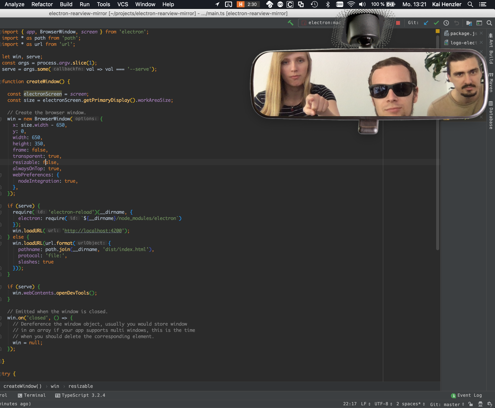

[](https://angular.io/) [](https://electronjs.org/)

# Introduction

Rearview / Backview mirror for your Computer
Read the article about this App on https://www.thecodecampus.de/blog/building-a-rear-view-mirror-app-with-electron-and-angular

[](https://www.thecodecampus.de/blog/building-a-rear-view-mirror-app-with-electron-and-angular) 

## Download 

See binaries located in the release tab

https://github.com/kaihenzler/electron-rearview-mirror/releases/tag/1.0.0

## Getting Started

Clone this repository locally :

``` bash
git clone https://github.com/kaihenzler/electron-rearview-mirror
```

Install dependencies with npm :

``` bash
npm install
```

Build for your target system :

``` bash
npm run electron:mac 
npm run electron:linux 
npm run electron:windows
```

Run the App and share it with your colleagues :-)

## Images

- Background Image of the rear view mirror (For Personal Use) - Source: https://www.kisspng.com/png-mac-app-store-macos-apple-rear-view-mirror-car-mir-1026435/download-png.html
- App Icon (For Personal Use) - Source: https://www.kisspng.com/png-car-computer-icons-rear-view-mirror-4290757/

## Based on

https://github.com/maximegris/angular-electron
